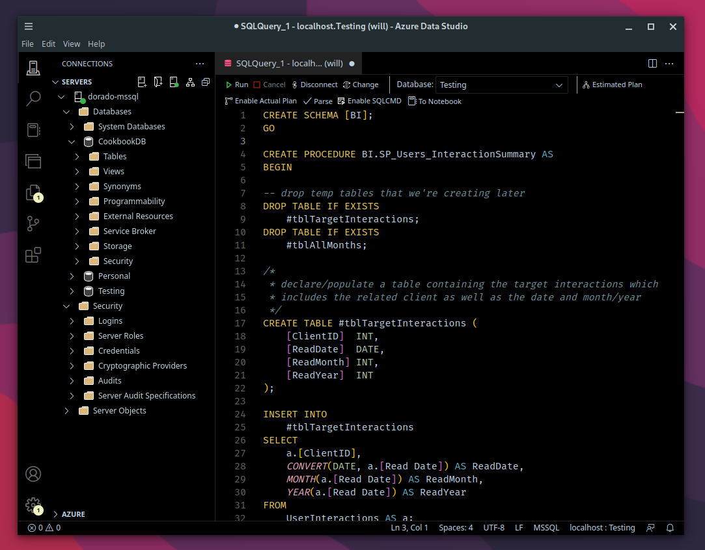

# Black

A port of the [Black color theme by Jaakkko](https://github.com/Jaakkko/vscode-black-theme) for Visual Studio Code targeting Azure Data Studio.

## Preview

[](https://github.com/will-hinson/ads-black-theme/blob/main/assets/preview.png "Preview Image")

## Manual Installation

First, ensure that you have `vsce` installed locally so you can build the package:

```sh
npm install -g @vscode/vsce
```

Then, clone and build the package as a `.vsix` file:

```sh
git clone https://github.com/will-hinson/ads-black-theme/
cd ads-black-theme
vsce package
```

Finally, use the `Extensions: Install from VSIX...` command in the Azure Data Studio command palette and select the `.vsix` file you built in the previous step.
